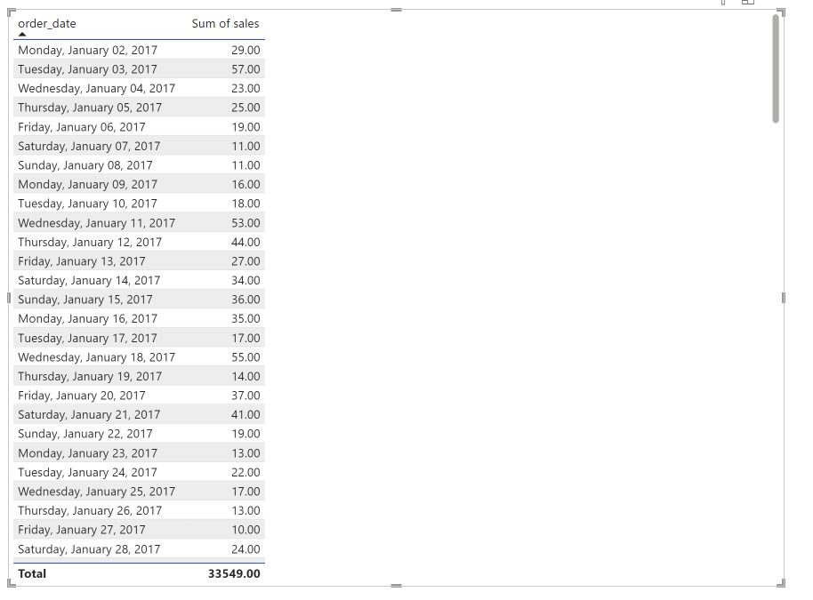
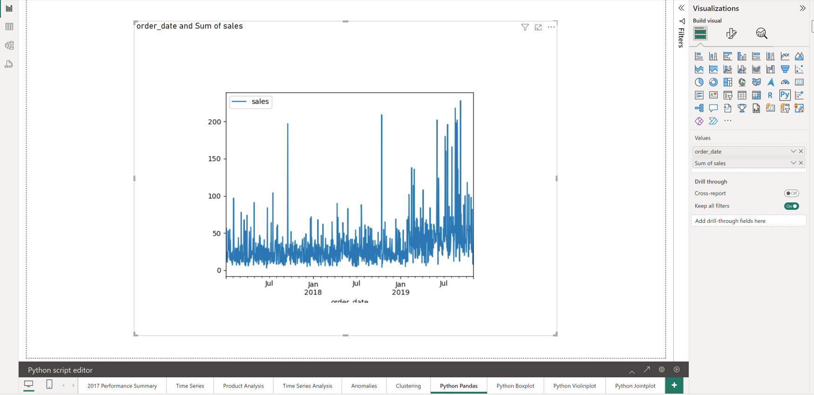
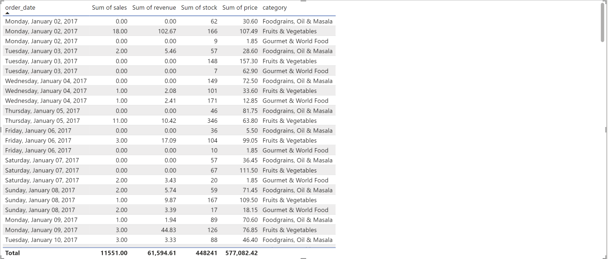
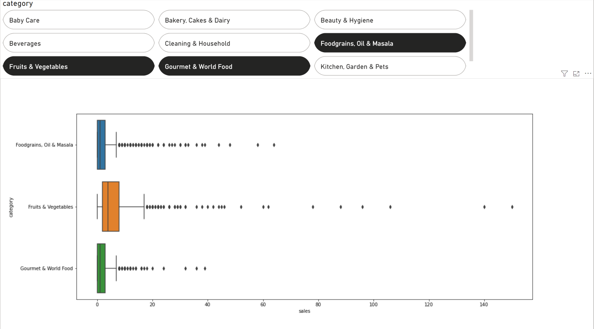
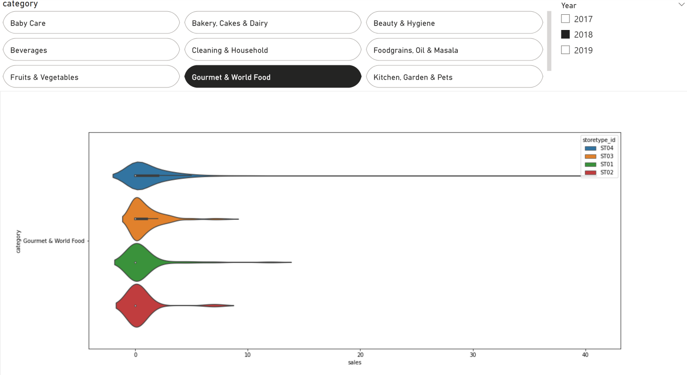
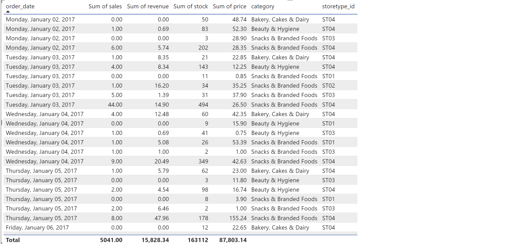
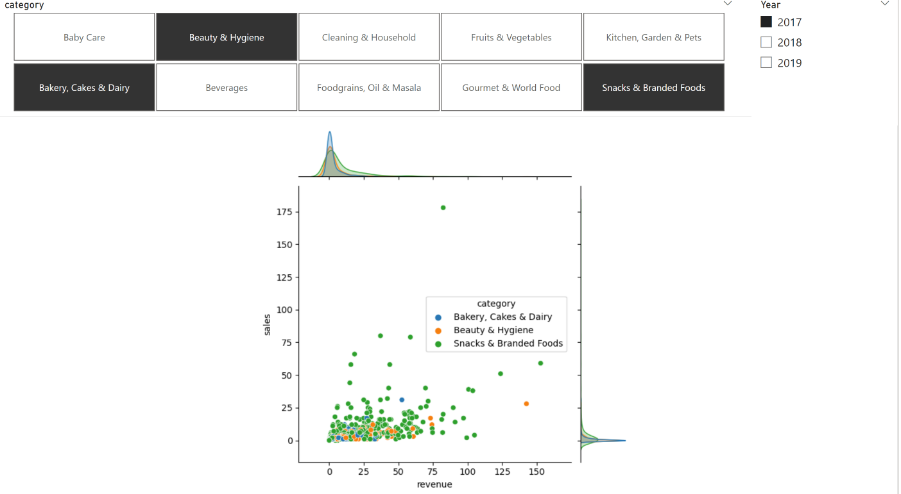
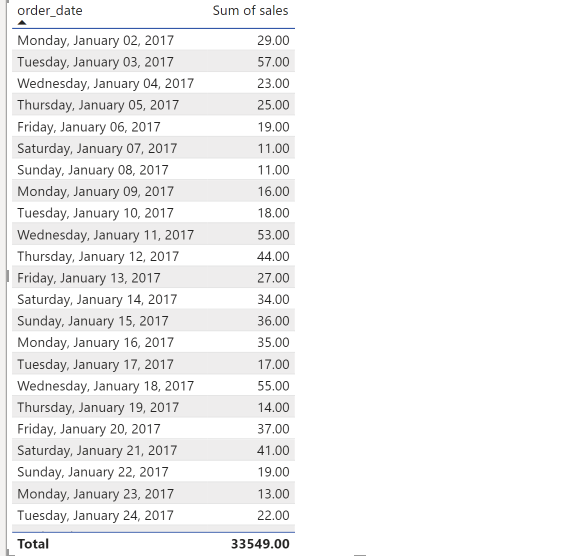
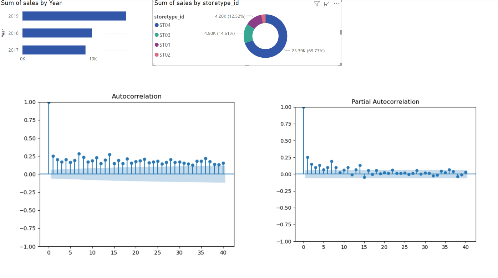

# Python Examples

* Examples using the in-class dataset (sales data)

## Basic Pandas plotting





```python
# The following code to create a dataframe and remove duplicated rows is always executed and acts as a preamble for your script: 

# dataset = pandas.DataFrame(order_date, sales, revenue)
# dataset = dataset.drop_duplicates()

# Paste or type your script code here:

import pandas as pd
import matplotlib.pyplot as plt

df = dataset

df['order_date'] = pd.to_datetime(df['order_date'])
df = df.set_index('order_date')

df.plot(subplots=True)
plt.show()
```

## Seaborn Boxplot with Slicers





```python
# The following code to create a dataframe and remove duplicated rows is always executed and acts as a preamble for your script: 

# dataset = pandas.DataFrame(order_date, sales, revenue, stock, price, category)
# dataset = dataset.drop_duplicates()

# Paste or type your script code here:

import seaborn as sns
import matplotlib.pyplot as plt

sns.boxplot(data=dataset, x='sales', y='category')


plt.show()
```

## Seaborn Violinplot with Slicers




```python
# The following code to create a dataframe and remove duplicated rows is always executed and acts as a preamble for your script: 

# dataset = pandas.DataFrame(order_date, sales, revenue, stock, price, category)
# dataset = dataset.drop_duplicates()

# Paste or type your script code here:

import seaborn as sns
import matplotlib.pyplot as plt

sns.violinplot(data=dataset, x='sales', y='category', hue='storetype_id')


plt.show()

```

### Seaborn Jointplot with Slicers





```python
# The following code to create a dataframe and remove duplicated rows is always executed and acts as a preamble for your script: 

# dataset = pandas.DataFrame(order_date, sales, revenue, stock, price, category)
# dataset = dataset.drop_duplicates()

# Paste or type your script code here:

import seaborn as sns
import matplotlib.pyplot as plt

sns.jointplot(data=dataset, x='revenue', y='sales', hue='category')

plt.show()
```


## Statsmodels with other native charts





**Autocorrelation ACF Plot**

```python
# The following code to create a dataframe and remove duplicated rows is always executed and acts as a preamble for your script: 

# dataset = pandas.DataFrame(order_date, sales, revenue, stock, price, category)
# dataset = dataset.drop_duplicates()

# Paste or type your script code here:

import pandas as pd
import matplotlib.pyplot as plt
import statsmodels.api as sm

df = dataset[['order_date', 'sales']]
df = df.set_index('order_date')

sm.graphics.tsa.plot_acf(df, lags=40)

plt.show()
```

**Partial Autocorrelation PACF Plot**

```python
# The following code to create a dataframe and remove duplicated rows is always executed and acts as a preamble for your script: 

# dataset = pandas.DataFrame(order_date, sales, revenue, stock, price, category)
# dataset = dataset.drop_duplicates()

# Paste or type your script code here:

import pandas as pd
import matplotlib.pyplot as plt
import statsmodels.api as sm

df = dataset[['order_date', 'sales']]
df = df.set_index('order_date')

sm.graphics.tsa.plot_pacf(df, lags=40)

plt.show()
```

