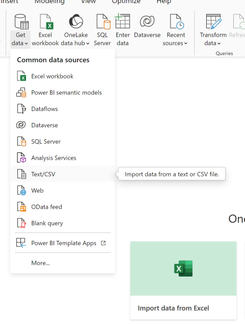
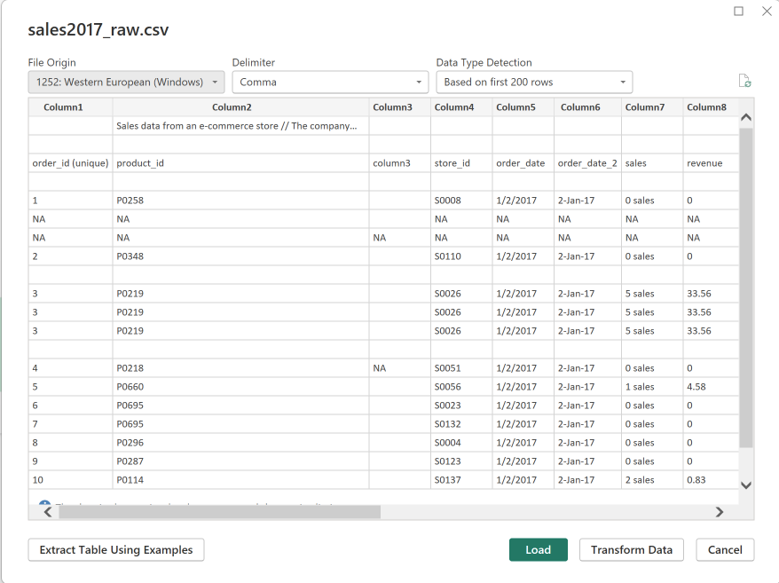
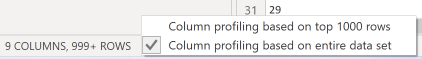
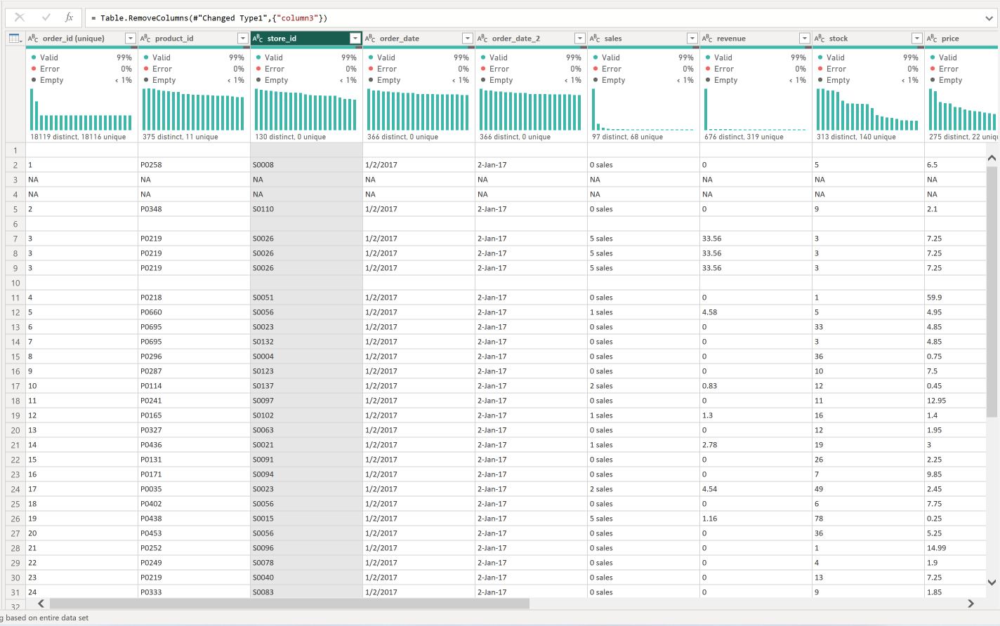
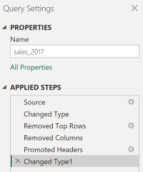
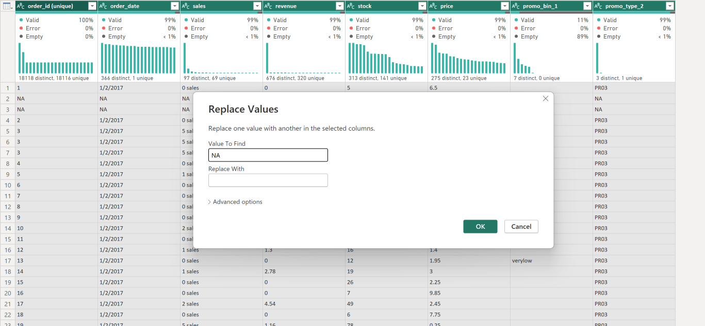
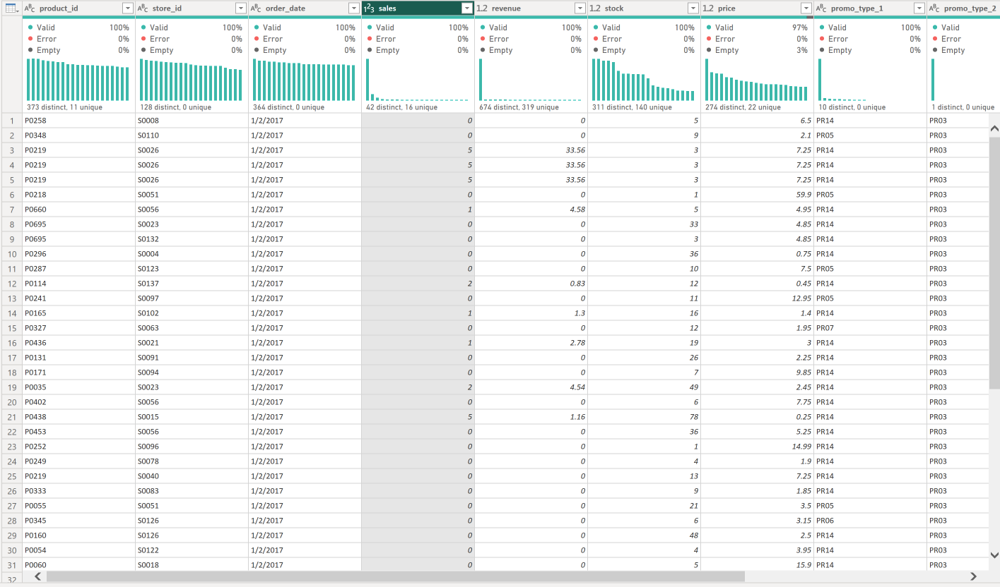
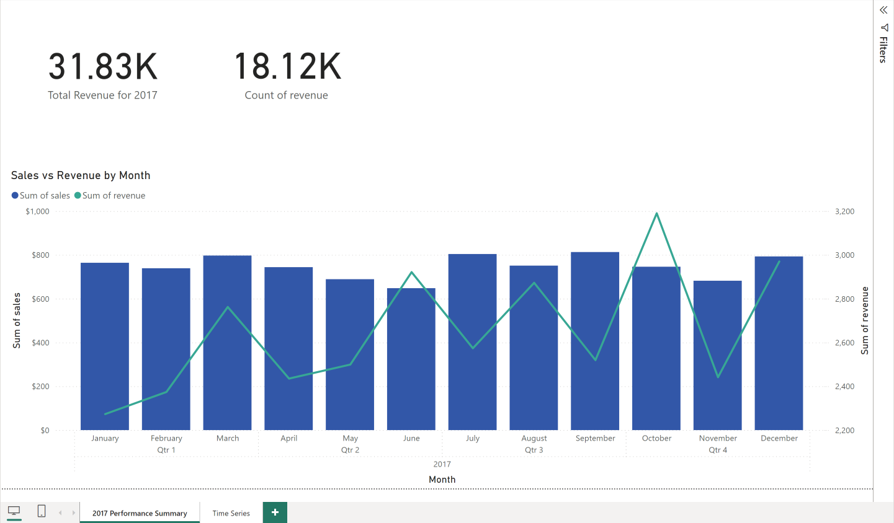
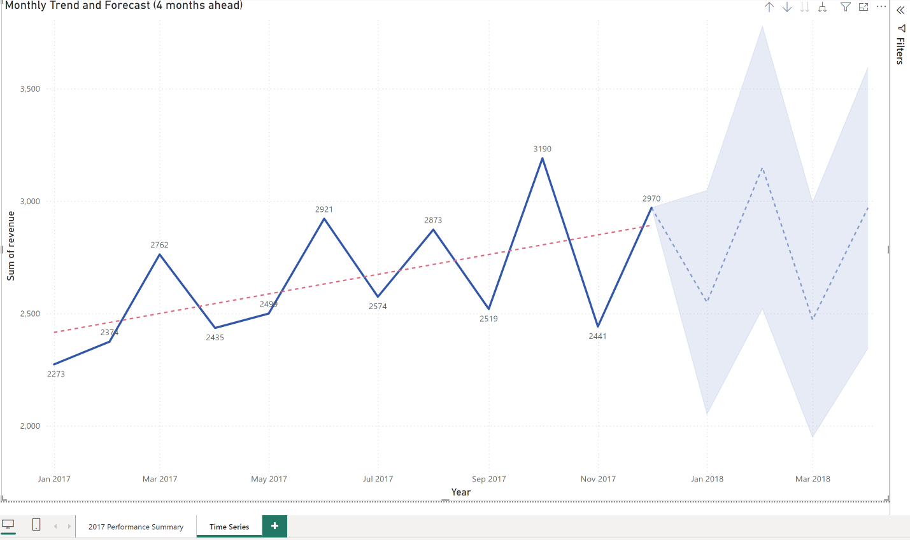
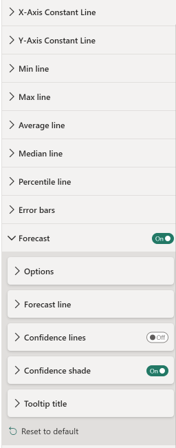

# Sales Analysis Activity 1

# Testing

## Data Wrangling (Transformation)

1. Load the `sales_2017_raw.csv` data 

2. There are some data issues that you will need to fix first. So, click on Transform Data 

* Remember, the profiling is base don the first 1000 rows. 

 

* Remove the first 2 rows
* Remove Column 3
* Then, make the first row as header

Your result should look like the following

Here are the applied steps so far

* From Remove Rows, select Remove Blank Rows
* Remove `promo_bin_1` , `promo_bin_2`, `promo_discount_2` , and `order_date_2` columns
* Replace “ALL” `NA` values with blank or you can use the keyword `null`

* Then again, select Remove Blank Rows
* Convert `Oder_Date` to a date type
* Convert `Revenue`, `Stock`, and `Price` to proper type for calculations 
* For sales, extract the number of sales for example `3 sales` should be a numeric value `3`
  * Hint: Check out Split Column by Delimiter 
  * Is there another way to do this?

* Rename columns `sales.1` column to `sales`, change to proper data type if needed,  and remove `sales.2 `column

* What transformation needed for `order_date` column?
* What about the last two columns `delivery_date_format1` and `delivery_date_format2`?
* Once you are done, select **Apply and close**

## Data Visualization

Try to match the following the analysis using the dataset you just prepared 

**Screen 1**

**Screen 2**

**Hints:**

* Explore the Forecast Options

* Explore the Seasonality option try 4 and 12 for example 
* Notice the forecast is for 4 months ahead 
* Use the 95% confidence interval 

