# Sales Analysis Activity 2

After you completed your analysis for 2017 you realized there are additional data sources that are needed for a more comprehensive analysis. This includes sales data for 2018 and 2018, as well as store and product related data.

## Load the data & transform the data

* Load `sales_2018`, and `sales_2019` data sets

  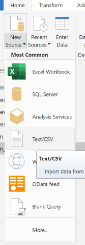

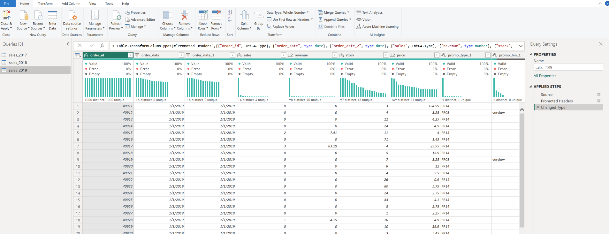

* In order to combine the sales data (2017, 2018, and 2019) make sure you have the same columns (names, and types) for all three data sets
* If there are any “NA” text in price you can replace them with `0`
* If you see errors in one of the columns as shown you can remove error rows

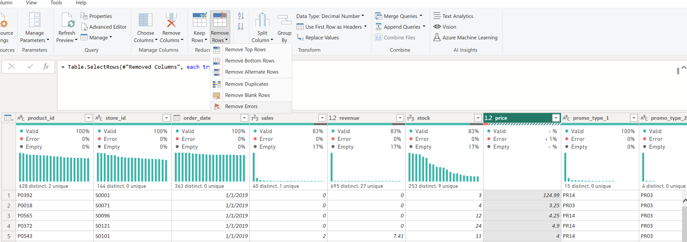

Here are the columns and their data types. Make sure all three have the same 

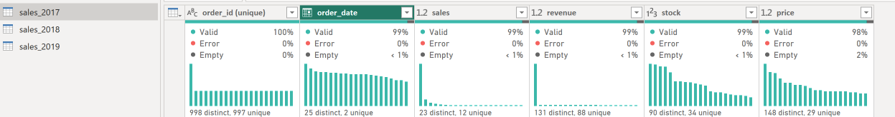

* Select Append Queries to stack the data on top of each other (2017, 2018, and 2019)
* Select Append Queries as New

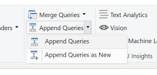

Then select `Three or more tables`

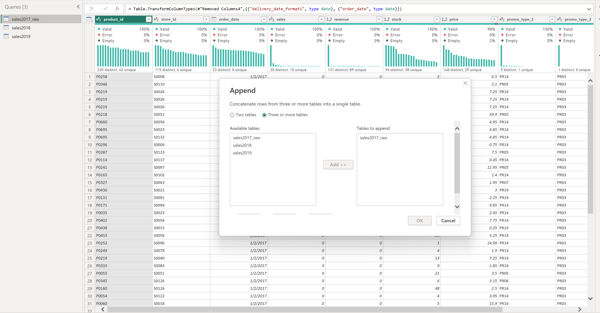

Combined 2018 and 2019 data with 2017 

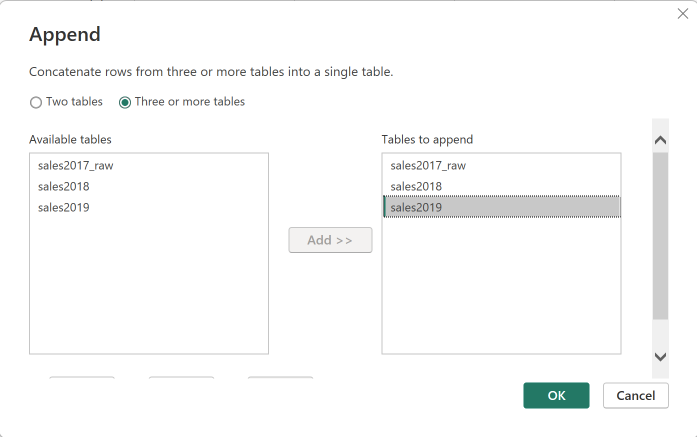

* If you see the following message click `Continue`

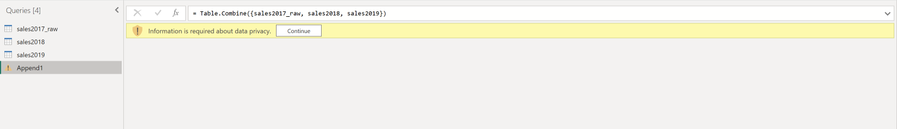

* Select `ignore Pricacy Levels checks for this file ...`

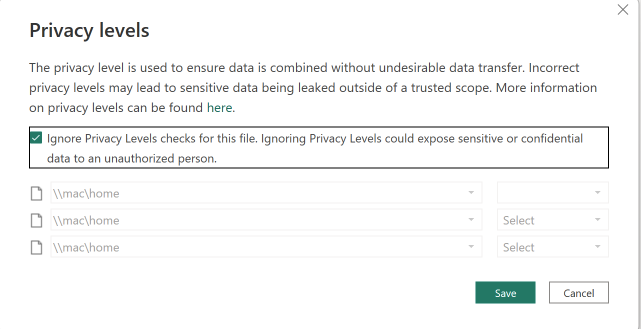

* Keep in mind the data is all combined under the `Append1` data. Rename the data from `Append1` to `Combined`

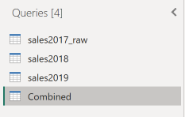

## Load additional data to support your analysis 

* Now add three more files  `store_cities` and `producthierarchy`

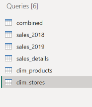

* Inspect the `store_cities` dataset 

  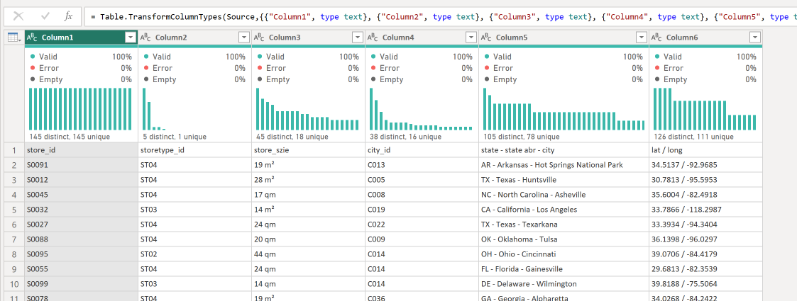

* Make first row as header
* Split the `state-state abr-city` columns into state, state abr, and city columns (3 columns)
* Split `lat/long` into two columns

This is the final output

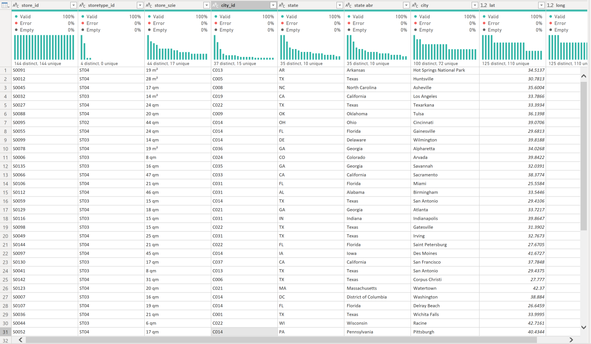

* Inspect the `producthierarchy` dataset and notice we have several issues:

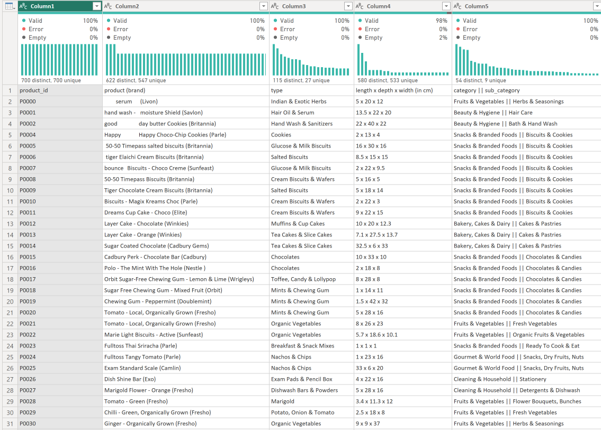

* Make the first row as headers 
* Click the `category || sub_category` column and split into two fields

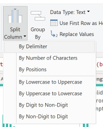

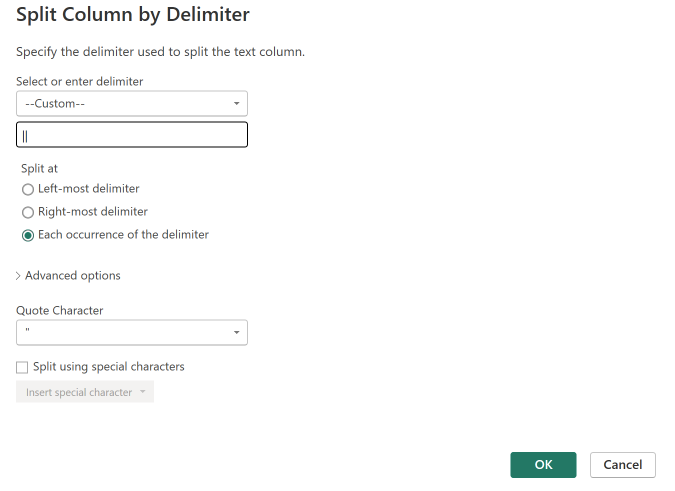

* Rename the column as shown

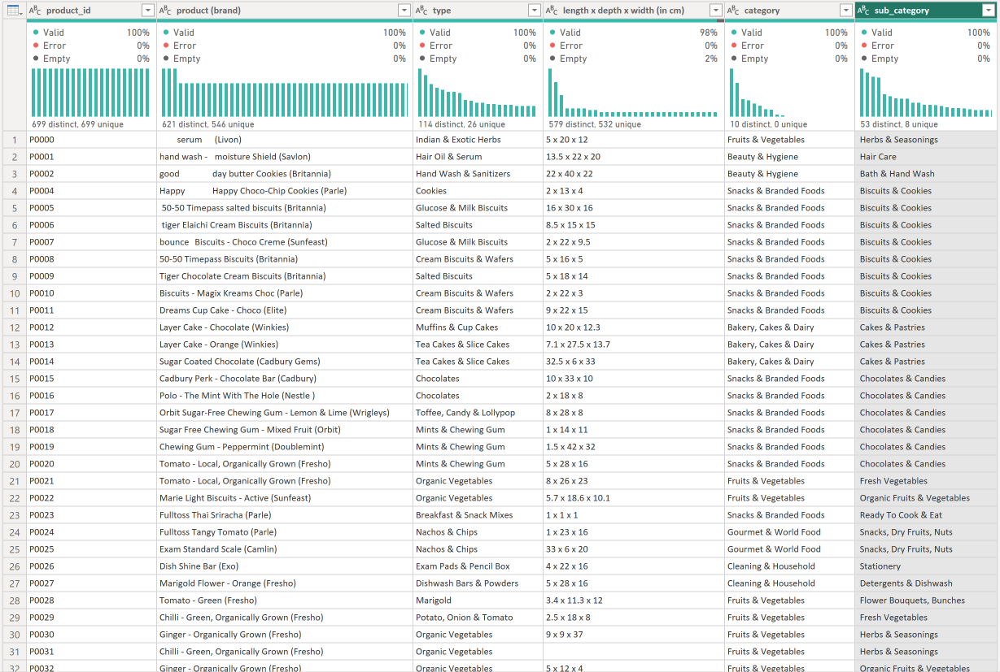

---

## Group your Queries

From this 

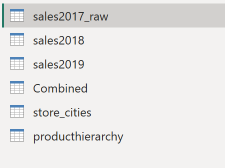

To this

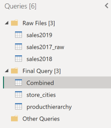

## Visualization Challenge

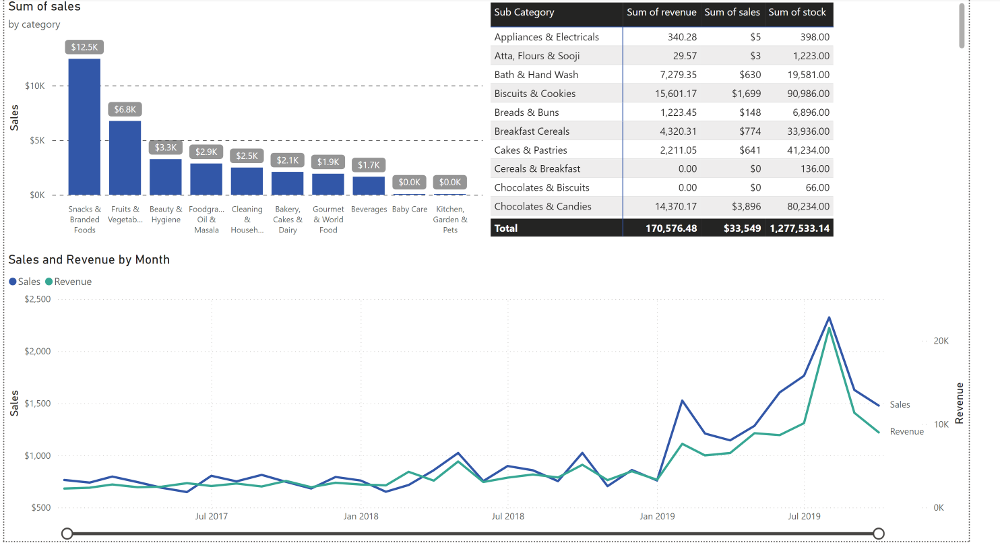

Note the time slider (zoom slider)

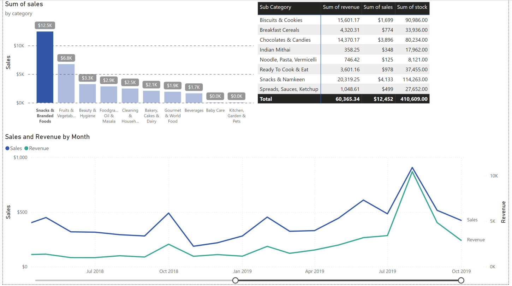

### Challenge 2 - Forecasting

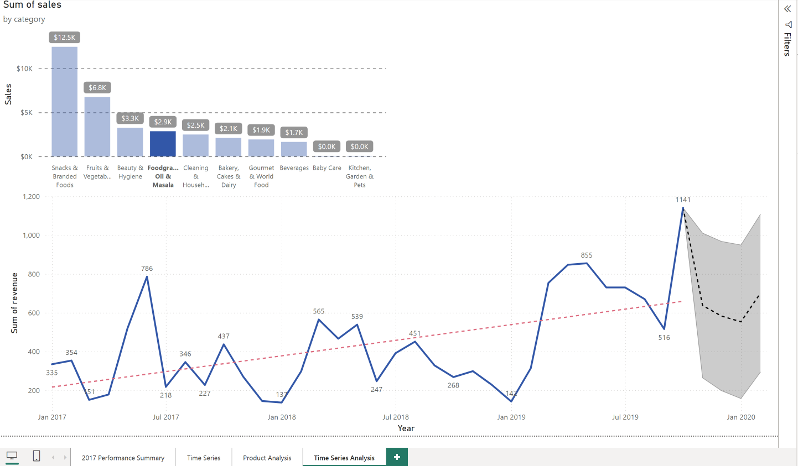

### Challenge 3 - Anomalies

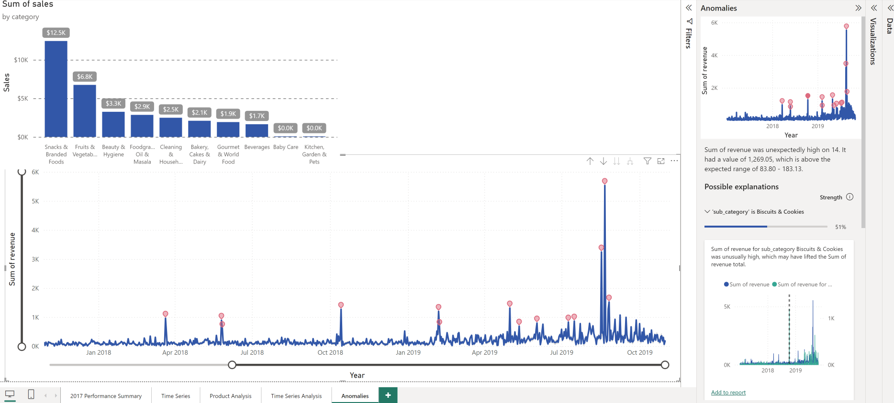

