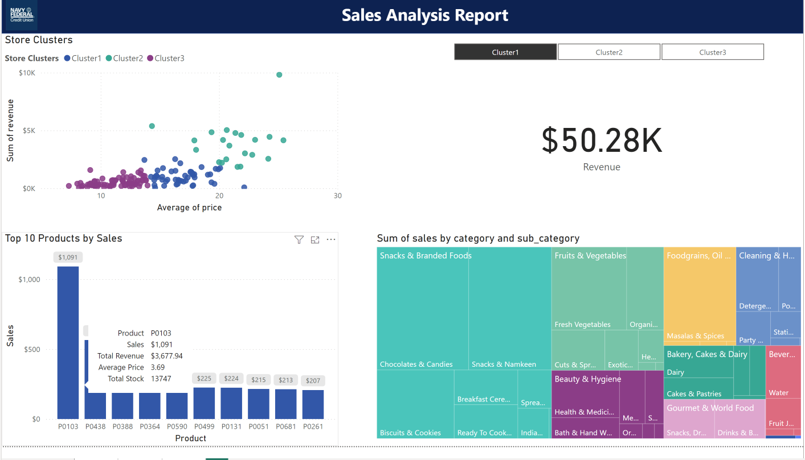
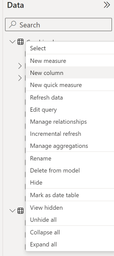
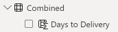
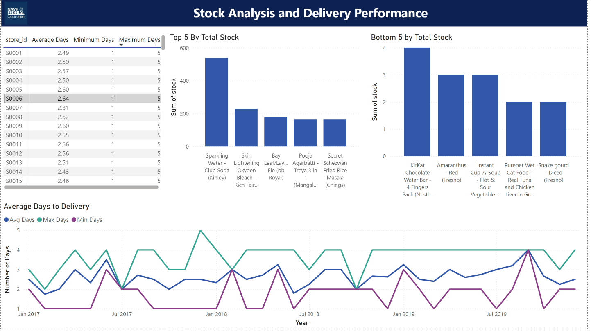

# Activity 5

## Screen 1

#### Notice:

**Bar Chart**

* The Bar Chart sorting of the categories
  * Hint: They are sorted alphabetically in ascending order 
* Bar Chart has major gridlines 
* Revenue and Sales show with \$ sign 
* Y-axis data labels show full numbers 

**Donut Chart**

* The Donut Chart with the Total in the middle showing
* The donut chart spacing (inner radius) have been adjusted to fit the text in the middle

**Line Chart**

* Line Chart does not have a legend, instead it series labels

**Slicer**

* The slicer is based on City and Store ID 
* You can multi-select with Ctrl (**See below**)

## Screen 2

* Create A Store Cluster (3 clusters) based on Average Price, Revenue, by Store 

  * You can do this through the Scatter Plot Visualization 

    

    You will see the “Automatically find clusters” option 

    

  

  The final output should look like this

  

* Create a Cluster Slicer

* The bar chart only shows Top 10 Products by Sales

* Edit the Interactions for each visualization 

  

  * The bar chart should not impact the treetop chart or scatter plot only the KPI
  * The cluster slicer should only filter the Bar Chart, Treetop, and KPI. Not the Scatter plot.
  * The scatter plot should not have any interaction with any other chart

* Notice the additional information in the tool tip for the bar chart for the Top 10 Products by Sales
  * Total Revenue
  * Average Price
  * Total Stock 

## Screen 3

* Calculate number of days between Order Date and Delivery Date to create a performance analysis

  * Hint:
  * Click Create New Columns 

  

  * Create a function similar to the following 

  *  `Days to Delivery = DATEDIFF(Combined[order_date], Combined[delivery_date_format1], DAY)`
  * Name the new column `Days to Delivery`

  

  

* Edit interactions. The two bar charts should not interact with each other nor should they interact with the table chart 

